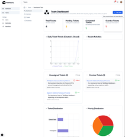
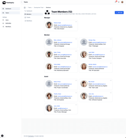
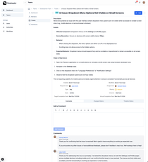
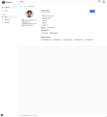
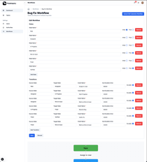
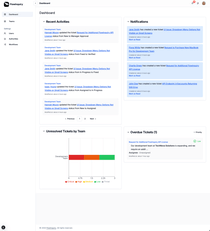

# FlowInquiry Server
[](https://github.com/flowinquiry/flowinquiry-server/actions/workflows/gradle.yml)

## Overview
FlowInquiry Server is the back-end component of the FlowInquiry platform, a modern solution for managing workflows and team collaboration. Built with Spring Boot, this server provides a robust and scalable REST API to power the FlowInquiry front-end application and integrates seamlessly with external services.

## Key Features
* **Comprehensive REST API**: Supports the FlowInquiry front-end client with endpoints for managing workflows, teams, requests, and more.
* **External Integrations**: Integrates with third-party services for enhanced functionality and interoperability.
* **Scalable Architecture**: Designed to handle high concurrency and diverse workloads, making it suitable for enterprise use.
* **Secure**: Implements industry-standard security practices, including authentication and role-based access control.

## Screenshots

<table>
  <tr>
    <td style="padding: 10px; text-align: center;">
      <a href="assets/team_dashboard.png">
        
      </a>
    </td>
    <td style="padding: 10px; text-align: center;">
      <a href="assets/team_members.png">
        
      </a>
    </td>
    <td style="padding: 10px; text-align: center;">
      <a href="assets/ticket_view.png">
        
      </a>
    </td>
  </tr>
  <tr>
    <td style="padding: 10px; text-align: center;">
      <a href="assets/user_view.png">
        
      </a>
    </td>
    <td style="padding: 10px; text-align: center;">
      <a href="assets/workflow_customization.png">
        
      </a>
    </td>
    <td style="padding: 10px; text-align: center;">
      <a href="assets/workspace_dashboard.png">
        
      </a>
    </td>
  </tr>
</table>


## Getting Started

### Prerequisites
* Java 21 or higher
* Gradle 8 or higher
* PostgreSQL (or compatible database)

### Setup Instructions

#### 1. Clone the repository:
```
   git clone git@github.com:flowinquiry/flowinquiry-server.git
   cd flowinquiry-server
```
#### 2. Configure application parameters

   Set up the application secrets by running the following script:
```bash
scripts/create_secrets.sh
```
This script generates the secrets for the PostgreSQL database and the JWT_BASE64_SECRET, storing them in the local .env.local file.

**Important**: For security reasons, ensure that .env.local is excluded from version control (e.g., by adding it to .gitignore).

#### 3. Build and run application

##### Run the postgres database

FlowInquiry utilizes PostgreSQL as its database and comes with pre-configured PostgreSQL settings. We recommend using Docker as a virtualized container for PostgreSQL. Docker makes it easy to test and run the same PostgreSQL version the FlowInquiry team uses daily, reducing the risk of database compatibility issues.

Ensure Docker is installed on your machine, then start the database by running the following command:
```bash
docker compose -f docker/services.yml up
```

##### Run the server

From the root folder, run the command:
```bash
./gradlew :server:bootRun
```
It may take some time before the server APIs are accessible on the default port 8080
```bash
➜  flowinquiry-server git:(main) ./gradlew :server:bootRun
INFO in org.springframework.boot.logging.logback.SpringBootJoranConfigurator@5618d5e5 - Registering current configuration as safe fallback point

______ _             _____                  _
|  ___| |           |_   _|                (_)
| |_  | | _____      _| | _ __   __ _ _   _ _ _ __ _   _
|  _| | |/ _ \ \ /\ / / || '_ \ / _` | | | | | '__| | | |
| |   | | (_) \ V  V /| || | | | (_| | |_| | | |  | |_| |
\_|   |_|\___/ \_/\_/\___/_| |_|\__, |\__,_|_|_|   \__, |
                                   | |              __/ |
                                   |_|             |___/


:: FlowInquiry 🤓  :: Running Spring Boot 3.4.0 :: Startup profile(s) dev ::
:: https://www.flowinquiry.io ::

INFO 35926 --- [  restartedMain] io.flowinquiry.FlowInquiryApp.logStarting:53 : Starting FlowInquiryApp using Java 21.0.5 with PID 35926 (/Users/hainguyen/Projects/flowinquiry-server/server/build/classes/java/main started by hainguyen in /Users/hainguyen/Projects/flowinquiry-server) 
DEBUG 35926 --- [  restartedMain] io.flowinquiry.FlowInquiryApp.logStarting:54 : Running with Spring Boot v3.4.0, Spring v6.2.0 
INFO 35926 --- [  restartedMain] io.flowinquiry.FlowInquiryApp.logStartupProfileInfo:658 : The following 1 profile is active: "dev" 
DEBUG 35926 --- [  restartedMain] io.flowinquiry.config.WebConfigurer.corsFilter:88 : Registering CORS filter 
```
## Related Information
- [FlowInquiry document](https://docs.flowinquiry.io): The centralized document for FlowInquiry products
- [FlowInquiry Server](https://github.com/flowinquiry/flowinquiry-server): Back-end services for FlowInquiry.
- [FlowInquiry Client](https://github.com/flowinquiry/flowinquiry-frontend): Front-end application.
- [FlowInquiry Ops](https://github.com/flowinquiry/flowinquiry-ops): Deployment and operational scripts.


## Discussions
For any inquiries about the project, including questions, proposals, or suggestions, please start a new discussion in the [Discussions](https://github.com/flowinquiry/flowinquiry-server/discussions) section. This is the best place to engage with the community and the FlowInquiry team

## License
This project is licensed under the [AGPLv3](LICENSE) License.