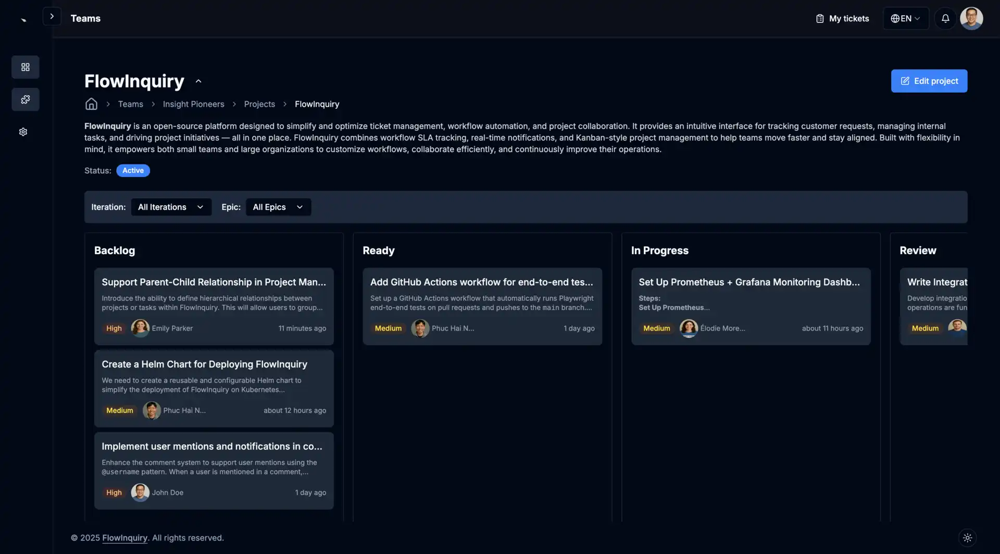

<div style="display: flex; justify-content: center; align-items: center;">
  <a href="https://flowinquiry.io" target="_blank">
    <picture>
      <source media="(prefers-color-scheme: dark)" srcset="assets/logo-dark.svg" type="image/svg+xml">
      
    </picture>
  </a>
</div>

<p align="center">
  <a href="https://flowinquiry.io"><strong>Main page</strong></a> |
  <a href="https://docs.flowinquiry.io"><strong>Explore the docs »</strong></a> |
  <a href="https://github.com/orgs/flowinquiry/projects/4/views/3"><strong>Backlogs</strong></a> |
  <a href="https://hub.docker.com/u/flowinquiry"><strong>Docker</strong></a>
</p>

[](https://github.com/flowinquiry/flowinquiry/actions/workflows/ci.yml)
[](https://github.com/flowinquiry/flowinquiry/graphs/contributors)
[](https://app.codacy.com/gh/flowinquiry/flowinquiry/dashboard?utm_source=gh&utm_medium=referral&utm_content=&utm_campaign=Badge_grade)
[](https://github.com/flowinquiry/flowinquiry/releases)
[](https://hub.docker.com/r/flowinquiry/flowinquiry-frontend)
[](https://hub.docker.com/r/flowinquiry/flowinquiry-server)
[](https://github.com/flowinquiry/flowinquiry-server/stargazers)


> ⭐ **If you find FlowInquiry useful, please consider giving us a star on [GitHub](https://github.com/flowinquiry/flowinquiry)!**. It motivates us a lot and helps the project grow!

## What is FlowInquiry

FlowInquiry is a free, open-source solution that embraces transparency as an alternative to Jira, ServiceNow, and Zendesk. Designed for managing cases, tickets, and requests, it streamlines communication, ensures timely resolutions, and supports customizable workflows with SLAs. By eliminating vendor lock-in and costly subscriptions, FlowInquiry enhances efficiency, accountability, and collaboration for teams handling internal and external inquiries.



## ✅ Real-World Use Cases Solved by FlowInquiry
FlowInquiry helps teams manage requests, projects, and collaboration with clarity and control. Here are common ways organizations use it:

* Project & Task Management
Organize tasks, set priorities, track progress, and ensure deadlines with workflow automation and SLAs.

* Cross-Team Collaboration
Centralize communication across teams, reduce misalignment, and route requests through well-defined workflows.

* IT & Internal Support
Manage service desk tickets like access requests or software issues with automated handling and clear ownership.

* Incident & On-Call Management
Track incidents with SLAs, escalation rules, and accountability—ideal for rotating shifts and critical operations.

## ⚙️ Key Features of FlowInquiry

* 📂 Projects – Organize tasks using a Kanban board, grouped by iterations and epics

* 🧩 Custom Workflows – Tailor request lifecycles with state transitions and actions

* ⏱ SLA Enforcement – Track deadlines, escalate overdue items

* 🔄 Real-time Updates – Stay instantly informed of changes in your teams, projects, or organizations

* 👥 Comments & Watchers – Collaborate with full visibility

* 📅 Timeline View – Visualize request history and changes

* 🧵 Change History – Full audit trail of updates

* 🔐 Role-Based Access – Secure, granular permissions

* 🌍 Multilingual Support – Serve global teams and users

* 🔄 Integrations – Connect with Email, Slack (upcoming), Github (upcoming) and more

* 🚀 Flexible Deployment – Run on Docker, Kubernetes (upcoming), or your own infra

## Built With

<div style="display: flex; justify-content: left; gap: 20px; align-items: center;">
    
    
    
    
    
    
    
    
</div>

## Getting Started

FlowInquiry uses a [monorepo](https://monorepo.tools/) structure to manage all parts of the application — including the backend, frontend, and documentation — in a single repository. This approach ensures consistency, shared tooling, and easier cross-service collaboration.

All core services are located in the apps/ directory:

* apps:
  * backend: The Spring Boot service that powers the API layer, business logic, database integrations, workflows, and backend features of FlowInquiry.
  * frontend: The Next.js web application that provides the user interface for the platform. It integrates with the backend via REST APIs, handles authentication, and supports both freemium and premium features through dynamic configuration.
  * ops: the central repository that provides artifacts and configuration files to help customers deploy FlowInquiry using Docker, Kubernetes, and other environments.
  * docs: A documentation site built with a [Nextra](https://nextra.site/) static site generator, providing guides, and setup instructions for developers and users.

To get started with setting up the frontend and backend locally, follow the official developer guides:

* [Frontend Setup Guide](https://docs.flowinquiry.io/developer_guides/frontend/getting_started)

* [Backend Setup Guide](https://docs.flowinquiry.io/developer_guides/backend/getting_started)

* [Documentation Setup Guide](https://docs.flowinquiry.io/developer_guides/documentation)

These guides provide step-by-step instructions to help you configure your environment, install dependencies, and run the services in development mode.

## 🚀 Quick Launch

Have Docker installed? Get FlowInquiry running in seconds!

```
# Using wget
wget -O install-flowinquiry.sh https://raw.githubusercontent.com/flowinquiry/flowinquiry/refs/heads/main/apps/ops/flowinquiry-docker/scripts/install-flowinquiry.sh && chmod +x install-flowinquiry.sh && ./install-flowinquiry.sh

# Or using curl
curl -sSL https://raw.githubusercontent.com/flowinquiry/flowinquiry/refs/heads/main/apps/ops/flowinquiry-docker/scripts/install-flowinquiry.sh -o install-flowinquiry.sh && chmod +x install-flowinquiry.sh && ./install-flowinquiry.sh
```
This will:

* Download the necessary setup scripts directly from FlowInquiry's GitHub repository

* Prompt you for basic inputs (such as whether to enable SSL)

* Automatically configure and launch FlowInquiry

### 🖥️ Example Console Output After Installation

After running the installation script, you will see output similar to the following:

```bash
➜  flowinquiry-docker git:(main) ✗ install-flowinquiry.sh
🔍 Checking Docker installation...
✅ Docker and Docker Compose are properly installed and running.
📥 Checking installation directory...
✅ $USER-HOME/flowinquiry-docker already exists, preserving existing files.
🗑️ Cleaning up scripts directory...
📥 Downloading necessary files...
✅ File successfully downloaded to $USER-HOME/flowinquiry-docker/scripts/all.sh using curl
✅ File successfully downloaded to $USER-HOME/flowinquiry-docker/scripts/shared.sh using curl
✅ File successfully downloaded to $USER-HOME/flowinquiry-docker/scripts/backend-env.sh using curl
✅ File successfully downloaded to $USER-HOME/flowinquiry-docker/scripts/frontend-env.sh using curl
✅ File successfully downloaded to $USER-HOME/flowinquiry-docker/Caddyfile_http using curl
✅ File successfully downloaded to $USER-HOME/flowinquiry-docker/Caddyfile_https using curl
✅ File successfully downloaded to $USER-HOME/flowinquiry-docker/services_http.yml using curl
✅ File successfully downloaded to $USER-HOME/flowinquiry-docker/services_https.yml using curl
🔧 Making scripts executable...
🚀 Running setup scripts...
frontend-env.sh succeeded.
🔒 SSL Configuration
SSL is recommended when installing FlowInquiry for production use or when accessing from anywhere.
For local testing purposes, you may not need SSL.
Do you want to set up FlowInquiry with SSL? (y/n): n
⚠️ Setting up without SSL (HTTP only)
🐳 Starting services with Docker Compose...
Using host IP address: 192.168.0.78
Your service will be available at: http://192.168.0.78:1234
Using host IP address: 192.168.0.78
[+] Running 4/4
 ✔ Container flowinquiry-front-end-1                                                                                                                       Recreated                                                                                                                                                                                                                                                                                                      0.0s
 ✔ Container flowinquiry-back-end-1                                                                                                                        Recreated                                                                                                                                                                                                                                                                                                      0.1s
 ✔ Container flowinquiry-postgresql-1                                                                                                                      Recreated                                                                                                                                                                                                                                                                                                      0.0s
 ! back-end The requested image's platform (linux/amd64) does not match the detected host platform (linux/arm64/v8) and no specific platform was requested                                                                                                                                                                                                                                                                                                                0.0s
Attaching to back-end-1, front-end-1, postgresql-1
back-end-1    | The application will start in 0s...
front-end-1   |    ▲ Next.js 15.3.1
front-end-1   |    - Local:        http://localhost:3000
front-end-1   |    - Network:      http://0.0.0.0:3000
front-end-1   |
front-end-1   |  ✓ Starting...
front-end-1   |  ✓ Ready in 34ms

back-end-1    |   INFO 1 --- [  restartedMain] io.flowinquiry.FlowInquiryApp.logApplicationStartup:120 : ----------------------------------------------------------
back-end-1    |   INFO 1 --- [  restartedMain] io.flowinquiry.FlowInquiryApp.logApplicationStartup:121 :        Application 'FlowInquiry' is running! Access URLs:
back-end-1    |   INFO 1 --- [  restartedMain] io.flowinquiry.FlowInquiryApp.logApplicationStartup:122 :        Local:          http://localhost:8080/
back-end-1    |   INFO 1 --- [  restartedMain] io.flowinquiry.FlowInquiryApp.logApplicationStartup:123 :        External:       http://172.18.0.4:8080/
back-end-1    |   INFO 1 --- [  restartedMain] io.flowinquiry.FlowInquiryApp.logApplicationStartup:124 :        Profile(s):     prod
```

### 🌐 Accessing FlowInquiry
1. Open your browser and go to: `http://<LAN_IP>:1234`

2. Find your LAN IP address in the installation logs. Look for a message like:
```
Using host IP address: 192.168.0.78
```

3. Log in with the default administrator credentials:
- **Username:** `admin@flowinquiry.io`
- **Password:** `admin`

➡️ For **testing purposes**, it is safe to select **`n`** (no SSL) and run FlowInquiry over plain HTTP within your local network.  
➡️ For **production deployments**, it is strongly recommended to select **`y`** and configure SSL for secure access.


> FlowInquiry also supports a manual installation process, allowing you to run each step individually if you prefer to understand what happens at each stage. [Learn more in the step-by-step guide](https://docs.flowinquiry.io/user_guides/setup/basic_installation#2-manual-step-by-step-installation)

## License
This project is licensed under the [AGPLv3](LICENSE) License.

## How to Contribute

We welcome contributions of all kinds — not just code!

You can:
- Star the project ⭐
- Share it on social media 📢
- Create a tutorial or video 🎥
- Report bugs or suggest improvements 🐛
- Submit a pull request 🛠️
  Help with Localization 🌍 – [Contribute a Translation](https://docs.flowinquiry.io/how_to_contributes/localization)

Read the full guide: [How to Contribute to FlowInquiry](https://docs.flowinquiry.io/how_to_contributes/your_action_is_meaningful_to_us)


## 💪 Contributors

Thanks to all the contributors! 🙌  

[](https://github.com/flowinquiry/flowinquiry-server/graphs/contributors)