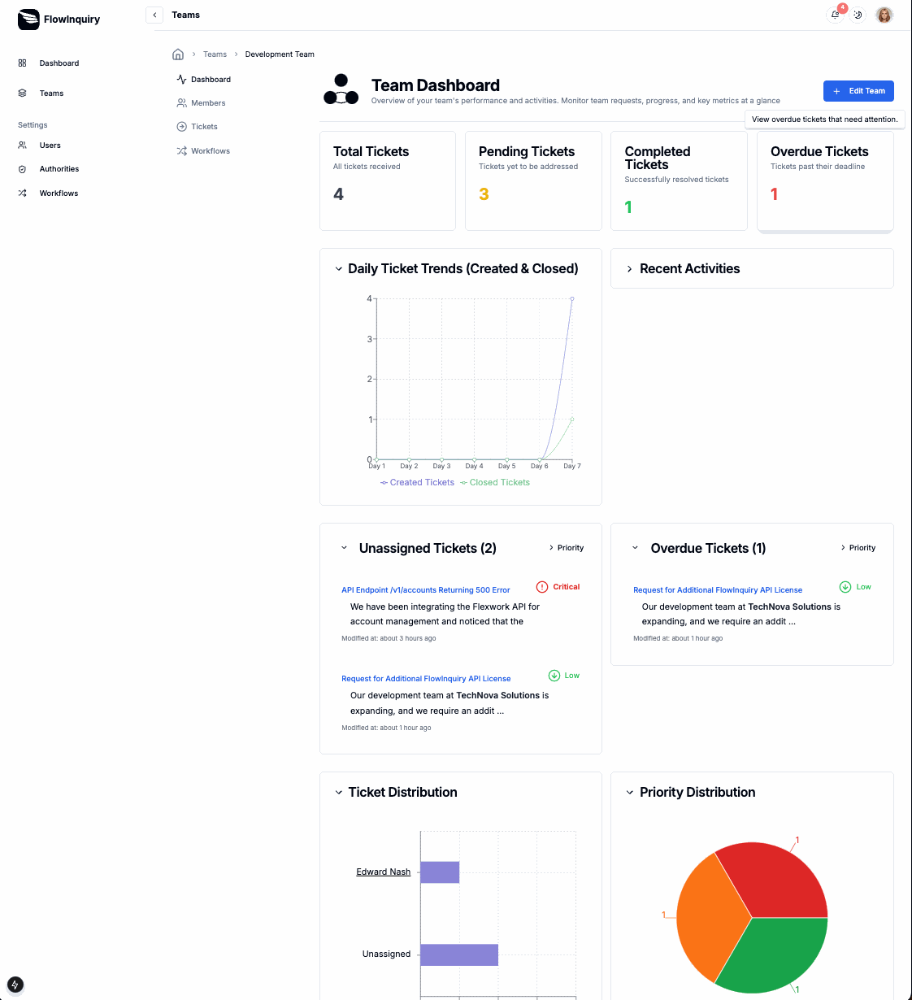

# FlowInquiry Server

  <a href="https://flowinquiry.io" target="_blank">
    <picture>
      <source media="(prefers-color-scheme: dark)" srcset="assets/logo-dark.svg" type="image/svg+xml">
      
    </picture>
  </a>

   
  <a href="https://flowinquiry.io" rel="dofollow"><strong>Main page</strong></a> 
  | 
  <a href="https://docs.flowinquiry.io" rel="dofollow"><strong>Explore the docs »</strong></a>
  |
  <a href="https://github.com/orgs/flowinquiry/projects/4/views/3" rel="dofollow"><strong>Backlogs</strong></a>
  |
  <a href="https://hub.docker.com/r/flowinquiry/flowinquiry-server" rel="dofollow"><strong>Docker</strong></a>
   

## What is FlowInquiry

FlowInquiry is a free, open-source solution that embraces transparency as an alternative to Jira, ServiceNow, and Zendesk. Designed for managing cases, tickets, and requests, it streamlines communication, ensures timely resolutions, and supports customizable workflows with SLAs. By eliminating vendor lock-in and costly subscriptions, FlowInquiry enhances efficiency, accountability, and collaboration for teams handling internal and external inquiries.

### Problems FlowInquiry Solves with Specific Use Cases

FlowInquiry addresses several challenges faced by organizations in managing cases, tickets, and team communication. Here are some specific use cases:

* **On-Call System Management** In an on-call system, teams often face challenges in managing incoming requests or incidents, particularly when multiple shifts or team members are involved. FlowInquiry ensures that each request follows a well-defined workflow, with SLAs for escalation and resolution. This helps reduce response times, avoids missed escalations, and provides clear accountability for handling incidents.

* **Case Management in CRM Applications**  CRM applications often struggle to manage customer cases effectively, especially when handling inquiries, complaints, or service requests. FlowInquiry enables teams to define custom workflows tailored to specific case types, such as refunds, escalations, or product inquiries. SLAs for each workflow stage ensure customers receive timely updates and resolutions, enhancing customer satisfaction and loyalty.

* **Team Communication and Collaboration** Effective communication within and across teams can be difficult in large organizations, especially when requests involve multiple departments or external stakeholders. FlowInquiry acts as a centralized platform where requests are logged, tracked, and routed through clearly defined workflows. This reduces miscommunication, prevents delays, and ensures all parties are aligned on priorities.

* **Service Request Tracking for IT Teams** IT teams managing internal service requests often encounter bottlenecks due to unclear processes or manual tracking. FlowInquiry allows IT departments to automate workflows for common requests such as software installation, access management, or issue resolution. The system ensures each request is assigned, processed, and resolved within agreed SLAs.

* **Project management** Teams can use FlowInquiry as a project management tool to create, assign, and prioritize tasks, track progress with workflows, and ensure timely completion with SLAs and automation. Its collaboration features, real-time updates, and integration capabilities streamline workflows and boost productivity.

By tailoring workflows to these and other scenarios, FlowInquiry empowers teams to streamline operations, meet deadlines, and deliver exceptional service to both internal and external stakeholders.

## Intro

FlowInquiry Server serves as the back-end component of the FlowInquiry service, a Java-based platform designed to manage workflows and enhance team collaboration. Developed with Spring Boot, the server provides a reliable and scalable REST API to support the FlowInquiry front-end application. It also facilitates workflow management, runs scheduler programs for task automation, handles data caching for efficient performance, and ensures seamless data persistence to the database

## Built With

    
    
    
    
    

## Stay Up-to-Date

## Getting Started

To have the FlowInquiry back-end up and running, please follow the [Getting Started](https://docs.flowinquiry.io/developer_guides/backend/getting_started) guide

## Deploy FlowInquiry
To ensure a smooth deployment process, we provide detailed guidelines for deploying FlowInquiry in various environments. These instructions cover setup steps, configuration details, and best practices for deploying the service effectively. You can find the deployment documentation [here](https://docs.flowinquiry.io/developer_guides/deployment)

## License
This project is licensed under the [AGPLv3](LICENSE) License.

## 💪 Contributors

Thanks to all the contributors! 🙌  

