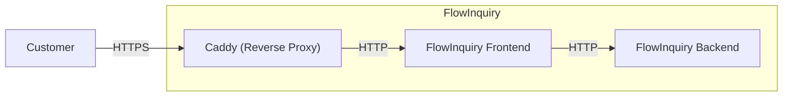

import { Callout, Tabs } from "nextra/components";

# Docker

## Multi-Platform Deployment

Our dedicated [location](https://github.com/flowinquiry/flowinquiry/tree/main/apps/ops) provides all the resources needed for flexible deployment configurations. With both the frontend and backend packaged as
Docker images, FlowInquiry is ready to run on any platform compatible with containerized solutions, such as Kubernetes, Docker Swarm, AWS, Azure, and more

### Docker Compose

The Docker Compose example demonstrates how to quickly run FlowInquiry in a containerized environment, ideal for testing or local LAN use.
For more details, explore the flowinquiry-docker folder in the [flowinquiry-ops](https://github.com/flowinquiry/flowinquiry/tree/main/apps/ops) repository.



### FlowInquiry Docker Deployment: HTTP and HTTPS

In a testing environment, you can deploy FlowInquiry and access it over your LAN network without setting up TLS/SSL.

In a production environment, especially if FlowInquiry is exposed to the public internet, it is strongly recommended to configure TLS/SSL to secure all communications.

FlowInquiry's Docker setup supports both HTTP and HTTPS configurations separately, allowing you to choose the appropriate setup based on your deployment environment.

The FlowInquiry Docker Compose setup uses [Caddy](https://caddyserver.com/) as a reverse proxy to serve HTTPS even for both localhost and LAN environments.
Caddy is configured with a Caddyfile that supports the domains `localhost` and `local.flowinquiry.io`

<Tabs items={["https", "http"]}>
  <Tabs.Tab>
    Recommended for public deployments or production environments. Refer to the
    [Caddyfile for
    HTTPS](https://github.com/flowinquiry/flowinquiry/blob/main/apps/ops/flowinquiry-docker/Caddyfile_https).
  </Tabs.Tab>
  <Tabs.Tab>
    Suitable for local testing within a LAN network. Refer to the [Caddyfile for
    HTTP](https://github.com/flowinquiry/flowinquiry/blob/main/apps/ops/flowinquiry-docker/Caddyfile_http).
  </Tabs.Tab>
</Tabs>

You can change the domain name to any name you prefer.

<Callout type="info" emoji="ℹ️">
  If you use your custom domain in your local machine, remember to add it into
  the file `/etc/hosts`
</Callout>

**Installing FlowInquiry**

1. Navigate to the `flowinquiry-docker` folder.

2. Run the `install-flowinquiry.sh` script located in the scripts directory.

3. Follow the prompts and provide responses when requested. During the installation, you will be asked whether you want to set up SSL:

```
Do you want to set up FlowInquiry with SSL? (y/n):
```

You can choose to enable or skip SSL configuration based on your deployment needs.

```bash
➜  flowinquiry-docker git:(main) ✗ install-flowinquiry.sh
🔍 Checking Docker installation...
✅ Docker and Docker Compose are properly installed and running.
📥 Checking installation directory...
✅ $USER-HOME/flowinquiry-docker already exists, preserving existing files.
🗑️ Cleaning up scripts directory...
📥 Downloading necessary files...
✅ File successfully downloaded to $USER-HOME/flowinquiry-docker/scripts/all.sh using curl
✅ File successfully downloaded to $USER-HOME/flowinquiry-docker/scripts/shared.sh using curl
✅ File successfully downloaded to $USER-HOME/flowinquiry-docker/scripts/backend-env.sh using curl
✅ File successfully downloaded to $USER-HOME/flowinquiry-docker/scripts/frontend-env.sh using curl
✅ File successfully downloaded to $USER-HOME/flowinquiry-docker/Caddyfile_http using curl
✅ File successfully downloaded to $USER-HOME/flowinquiry-docker/Caddyfile_https using curl
✅ File successfully downloaded to $USER-HOME/flowinquiry-docker/services_http.yml using curl
✅ File successfully downloaded to $USER-HOME/flowinquiry-docker/services_https.yml using curl
🔧 Making scripts executable...
🚀 Running setup scripts...
The file $USER-HOME/flowinquiry-docker/scripts/../.backend.env already exists. Do you want to overwrite it? (y/n): y
Overwriting the existing file...
Running backend-env.sh...
Enter your database password:
Sensitive data has been written to $USER-HOME/flowinquiry-docker/scripts/../.backend.env with restricted permissions.
backend-env.sh succeeded.
Running frontend-env.sh...
The file $USER-HOME/flowinquiry-docker/scripts/../.frontend.env already exists. Do you want to overwrite it? (y/n): y
Overwriting the existing file...
Environment variables have been written to $USER-HOME/flowinquiry-docker/scripts/../.frontend.env
frontend-env.sh succeeded.
🔒 SSL Configuration
SSL is recommended when installing FlowInquiry for production use or when accessing from anywhere.
For local testing purposes, you may not need SSL.
Do you want to set up FlowInquiry with SSL? (y/n): n
⚠️ Setting up without SSL (HTTP only)
🐳 Starting services with Docker Compose...
Using host IP address: 192.168.0.78
Your service will be available at: http://192.168.0.78:1234
Using host IP address: 192.168.0.78
[+] Running 4/4
 ✔ Container flowinquiry-front-end-1                                                                                                                       Recreated                                                                                                                                                                                                                                                                                                      0.0s
 ✔ Container flowinquiry-back-end-1                                                                                                                        Recreated                                                                                                                                                                                                                                                                                                      0.1s
 ✔ Container flowinquiry-postgresql-1                                                                                                                      Recreated                                                                                                                                                                                                                                                                                                      0.0s
 ! back-end The requested image's platform (linux/amd64) does not match the detected host platform (linux/arm64/v8) and no specific platform was requested                                                                                                                                                                                                                                                                                                                0.0s
Attaching to back-end-1, front-end-1, postgresql-1
back-end-1    | The application will start in 0s...
front-end-1   |    ▲ Next.js 15.3.1
front-end-1   |    - Local:        http://localhost:3000
front-end-1   |    - Network:      http://0.0.0.0:3000
front-end-1   |
front-end-1   |  ✓ Starting...
front-end-1   |  ✓ Ready in 34ms

...
back-end-1    | INFO 1 --- [  restartedMain] liquibase.util.log:37 : UPDATE SUMMARY
back-end-1    | INFO 1 --- [  restartedMain] liquibase.util.log:37 : Run:                          0
back-end-1    | INFO 1 --- [  restartedMain] liquibase.util.log:37 : Previously run:               9
back-end-1    | INFO 1 --- [  restartedMain] liquibase.util.log:37 : Filtered out:                17
back-end-1    | INFO 1 --- [  restartedMain] liquibase.util.log:37 : -------------------------------
back-end-1    | INFO 1 --- [  restartedMain] liquibase.util.log:37 : Total change sets:           26
back-end-1    | INFO 1 --- [  restartedMain] liquibase.util.log:37 : FILTERED CHANGE SETS SUMMARY
back-end-1    | INFO 1 --- [  restartedMain] liquibase.util.log:37 : Context mismatch:            17
back-end-1    | INFO 1 --- [  restartedMain] liquibase.util.log:37 : Update summary generated
back-end-1    | INFO 1 --- [  restartedMain] liquibase.command.log:37 : Command execution complete
back-end-1    | WARN 1 --- [  restartedMain] io.flowinquiry.modules.collab.service.MailService.reloadMailSender:87 : MailService not configured. 'mail.host' or 'mail.port' is missing.
back-end-1    | INFO 1 --- [  restartedMain] org.springframework.data.jpa.repository.query.QueryEnhancerFactory.<clinit>:49 : Hibernate is in classpath; If applicable, HQL parser will be used.
back-end-1    | INFO 1 --- [  restartedMain] org.springframework.security.config.annotation.authentication.configuration.InitializeUserDetailsBeanManagerConfigurer$InitializeUserDetailsManagerConfigurer.configure:114 : Global AuthenticationManager configured with UserDetailsService bean with name appUserDetailService
back-end-1    | INFO 1 --- [  restartedMain] org.springframework.boot.actuate.endpoint.web.EndpointLinksResolver.<init>:60 : Exposing 1 endpoint beneath base path '/actuator'
back-end-1    | INFO 1 --- [  restartedMain] org.springframework.messaging.simp.broker.SimpleBrokerMessageHandler.info:117 : Starting...
back-end-1    | INFO 1 --- [  restartedMain] org.springframework.messaging.simp.broker.SimpleBrokerMessageHandler.info:117 : BrokerAvailabilityEvent[available=true, SimpleBrokerMessageHandler [org.springframework.messaging.simp.broker.DefaultSubscriptionRegistry@1db75f70]]
back-end-1    | INFO 1 --- [  restartedMain] org.springframework.messaging.simp.broker.SimpleBrokerMessageHandler.info:117 : Started.
back-end-1    | INFO 1 --- [  restartedMain] io.undertow.start:120 : starting server: Undertow - 2.3.18.Final
back-end-1    | INFO 1 --- [  restartedMain] org.xnio.<clinit>:95 : XNIO version 3.8.16.Final
back-end-1    | INFO 1 --- [  restartedMain] org.xnio.nio.<clinit>:58 : XNIO NIO Implementation Version 3.8.16.Final
back-end-1    | 2025-04-28T00:59:43.928Z  INFO 1 --- [  restartedMain] org.jboss.threads.<clinit>:55 : JBoss Threads version 3.5.0.Final
back-end-1    | 2025-04-28T00:59:43.974Z  INFO 1 --- [  restartedMain] org.springframework.boot.web.embedded.undertow.UndertowWebServer.start:121 : Undertow started on port 8080 (http) with context path '/'
back-end-1    | 2025-04-28T00:59:43.997Z  INFO 1 --- [  restartedMain] io.flowinquiry.FlowInquiryApp.logStarted:59 : Started FlowInquiryApp in 20.225 seconds (process running for 21.35)
back-end-1    | 2025-04-28T00:59:44.003Z  INFO 1 --- [  restartedMain] io.flowinquiry.health.JWTSetupChecker.run:32 : JWT secret found and ready to use
back-end-1    | 2025-04-28T00:59:44.004Z  WARN 1 --- [  restartedMain] io.flowinquiry.health.MailSetupChecker.run:28 : Email provider is not configured yet
back-end-1    | 2025-04-28T00:59:44.011Z  INFO 1 --- [  restartedMain] io.flowinquiry.FlowInquiryApp.logApplicationStartup:120 : ----------------------------------------------------------
back-end-1    | 2025-04-28T00:59:44.011Z  INFO 1 --- [  restartedMain] io.flowinquiry.FlowInquiryApp.logApplicationStartup:121 :        Application 'FlowInquiry' is running! Access URLs:
back-end-1    | INFO 1 --- [  restartedMain] io.flowinquiry.FlowInquiryApp.logApplicationStartup:122 :        Local:          http://localhost:8080/
back-end-1    | INFO 1 --- [  restartedMain] io.flowinquiry.FlowInquiryApp.logApplicationStartup:123 :        External:       http://172.18.0.4:8080/
back-end-1    | INFO 1 --- [  restartedMain] io.flowinquiry.FlowInquiryApp.logApplicationStartup:124 :        Profile(s):     prod
```

**Accessing FlowInquiry**

- Open your browser and go to `http://<LAN_IP>:1234`

- Find your LAN IP address in the log output. Look for a message like:

```bash
Using host IP address: 192.168.0.78
Your service will be available at: http://192.168.0.78:1234
Using host IP address: 192.168.0.78
```

In this example, you would access FlowInquiry at:
http://192.168.0.78:1234

- Login using the default administrator credentials:

  - Username: admin@flowinquiry.io

  - Password: admin

#### Local HTTPS

Caddy uses its local CA to issue certificates, which means that HTTP clients outside the container won’t automatically trust the TLS certificate served by Caddy.
To resolve this, you may need to install Caddy's root CA certificate in your host machine’s trust store.

The Caddy root CA certificate can be found at flowinquiry-docker/caddy/certificate-authority/root.crt. This file is only generated when you run the FlowInquiry stack
with Caddy included. For detailed steps, refer to the Caddy documentation: [Local HTTPS with Docker](https://caddyserver.com/docs/running#local-https-with-docker)

#### Upgrade FlowInquiry

TBD
