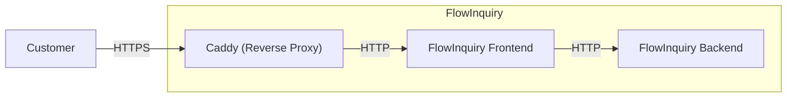

import { Callout, Tabs } from "nextra/components";

# Docker

## Multi-Platform Deployment

Our dedicated [location](https://github.com/flowinquiry/flowinquiry/tree/main/apps/ops) provides all the resources needed for flexible deployment configurations. With both the frontend and backend packaged as
Docker images, FlowInquiry is ready to run on any platform compatible with containerized solutions, such as Kubernetes, Docker Swarm, AWS, Azure, and more

### Docker Compose

The Docker Compose example demonstrates how to quickly run FlowInquiry in a containerized environment, ideal for testing or local LAN use.
For more details, explore the flowinquiry-docker folder in the [flowinquiry-ops](https://github.com/flowinquiry/flowinquiry/tree/main/apps/ops) repository.



### FlowInquiry Docker Deployment: HTTP and HTTPS

In a testing environment, you can deploy FlowInquiry and access it over your LAN network without setting up TLS/SSL.

In a production environment, especially if FlowInquiry is exposed to the public internet, it is strongly recommended to configure TLS/SSL to secure all communications.

FlowInquiry's Docker setup supports both HTTP and HTTPS configurations separately, allowing you to choose the appropriate setup based on your deployment environment.

The FlowInquiry Docker Compose setup uses [Caddy](https://caddyserver.com/) as a reverse proxy to serve HTTPS even for both localhost and LAN environments.
Caddy is configured with a Caddyfile that supports the domains `localhost` and `local.flowinquiry.io`

<Tabs items={["https", "http"]}>
  <Tabs.Tab>
    Recommended for public deployments or production environments. Refer to the
    [Caddyfile for
    HTTPS](https://github.com/flowinquiry/flowinquiry/blob/main/apps/ops/flowinquiry-docker/Caddyfile_https).
  </Tabs.Tab>
  <Tabs.Tab>
    Suitable for local testing within a LAN network. Refer to the [Caddyfile for
    HTTP](https://github.com/flowinquiry/flowinquiry/blob/main/apps/ops/flowinquiry-docker/Caddyfile_http).
  </Tabs.Tab>
</Tabs>

You can change the domain name to any name you prefer.

<Callout type="info" emoji="ℹ️">
  If you use your custom domain in your local machine, remember to add it into
  the file `/etc/hosts`
</Callout>

## Installing FlowInquiry

### 1. Quick Install (One Step)

FlowInquiry provides a convenient way to install the entire application with a single command. This method is ideal if you want the fastest setup without worrying about individual steps. Run one of the following scripts

```
# Using wget
wget -O install-flowinquiry.sh https://raw.githubusercontent.com/flowinquiry/flowinquiry/refs/heads/main/apps/ops/flowinquiry-docker/scripts/install-flowinquiry.sh && chmod +x install-flowinquiry.sh && ./install-flowinquiry.sh

# Or using curl
curl -sSL https://raw.githubusercontent.com/flowinquiry/flowinquiry/refs/heads/main/apps/ops/flowinquiry-docker/scripts/install-flowinquiry.sh -o install-flowinquiry.sh && chmod +x install-flowinquiry.sh && ./install-flowinquiry.sh
```

These scripts will guide you through the installation process with a few interactive prompts. You'll be asked to provide basic configuration details such as:

- Whether to enable SSL

- Your domain or IP address

```
Do you want to set up FlowInquiry with SSL? (y/n):
```

You can choose to enable or skip SSL configuration based on your deployment needs.

```bash
➜  flowinquiry-docker git:(main) ✗ install-flowinquiry.sh
🔍 Checking Docker installation...
✅ Docker and Docker Compose are properly installed and running.
📥 Checking installation directory...
✅ $USER-HOME/flowinquiry-docker already exists, preserving existing files.
🗑️ Cleaning up scripts directory...
📥 Downloading necessary files...
✅ File successfully downloaded to $USER-HOME/flowinquiry-docker/scripts/all.sh using curl
✅ File successfully downloaded to $USER-HOME/flowinquiry-docker/scripts/shared.sh using curl
✅ File successfully downloaded to $USER-HOME/flowinquiry-docker/scripts/backend-env.sh using curl
✅ File successfully downloaded to $USER-HOME/flowinquiry-docker/scripts/frontend-env.sh using curl
✅ File successfully downloaded to $USER-HOME/flowinquiry-docker/Caddyfile_http using curl
✅ File successfully downloaded to $USER-HOME/flowinquiry-docker/Caddyfile_https using curl
✅ File successfully downloaded to $USER-HOME/flowinquiry-docker/services_http.yml using curl
✅ File successfully downloaded to $USER-HOME/flowinquiry-docker/services_https.yml using curl
🔧 Making scripts executable...
🚀 Running setup scripts...
The file $USER-HOME/flowinquiry-docker/scripts/../.backend.env already exists. Do you want to overwrite it? (y/n): y
Overwriting the existing file...
Running backend-env.sh...
Enter your database password:
Sensitive data has been written to $USER-HOME/flowinquiry-docker/scripts/../.backend.env with restricted permissions.
backend-env.sh succeeded.
Running frontend-env.sh...
The file $USER-HOME/flowinquiry-docker/scripts/../.frontend.env already exists. Do you want to overwrite it? (y/n): y
Overwriting the existing file...
Environment variables have been written to $USER-HOME/flowinquiry-docker/scripts/../.frontend.env
frontend-env.sh succeeded.
🔒 SSL Configuration
SSL is recommended when installing FlowInquiry for production use or when accessing from anywhere.
For local testing purposes, you may not need SSL.
Do you want to set up FlowInquiry with SSL? (y/n): n
⚠️ Setting up without SSL (HTTP only)
🐳 Starting services with Docker Compose...
Using host IP address: 192.168.0.78
Your service will be available at: http://192.168.0.78:1234
Using host IP address: 192.168.0.78
[+] Running 4/4
 ✔ Container flowinquiry-front-end-1                                                                                                                       Recreated                                                                                                                                                                                                                                                                                                      0.0s
 ✔ Container flowinquiry-back-end-1                                                                                                                        Recreated                                                                                                                                                                                                                                                                                                      0.1s
 ✔ Container flowinquiry-postgresql-1                                                                                                                      Recreated                                                                                                                                                                                                                                                                                                      0.0s
 ! back-end The requested image's platform (linux/amd64) does not match the detected host platform (linux/arm64/v8) and no specific platform was requested                                                                                                                                                                                                                                                                                                                0.0s
Attaching to back-end-1, front-end-1, postgresql-1
back-end-1    | The application will start in 0s...
front-end-1   |    ▲ Next.js 15.3.1
front-end-1   |    - Local:        http://localhost:3000
front-end-1   |    - Network:      http://0.0.0.0:3000
front-end-1   |
front-end-1   |  ✓ Starting...
front-end-1   |  ✓ Ready in 34ms

...
back-end-1    | INFO 1 --- [  restartedMain] liquibase.util.log:37 : UPDATE SUMMARY
back-end-1    | INFO 1 --- [  restartedMain] liquibase.util.log:37 : Run:                          0
back-end-1    | INFO 1 --- [  restartedMain] liquibase.util.log:37 : Previously run:               9
back-end-1    | INFO 1 --- [  restartedMain] liquibase.util.log:37 : Filtered out:                17
back-end-1    | INFO 1 --- [  restartedMain] liquibase.util.log:37 : -------------------------------
back-end-1    | INFO 1 --- [  restartedMain] liquibase.util.log:37 : Total change sets:           26
back-end-1    | INFO 1 --- [  restartedMain] liquibase.util.log:37 : FILTERED CHANGE SETS SUMMARY
back-end-1    | INFO 1 --- [  restartedMain] liquibase.util.log:37 : Context mismatch:            17
back-end-1    | INFO 1 --- [  restartedMain] liquibase.util.log:37 : Update summary generated
back-end-1    | INFO 1 --- [  restartedMain] liquibase.command.log:37 : Command execution complete
back-end-1    | WARN 1 --- [  restartedMain] io.flowinquiry.modules.collab.service.MailService.reloadMailSender:87 : MailService not configured. 'mail.host' or 'mail.port' is missing.
back-end-1    | INFO 1 --- [  restartedMain] org.springframework.data.jpa.repository.query.QueryEnhancerFactory.<clinit>:49 : Hibernate is in classpath; If applicable, HQL parser will be used.
back-end-1    | INFO 1 --- [  restartedMain] org.springframework.security.config.annotation.authentication.configuration.InitializeUserDetailsBeanManagerConfigurer$InitializeUserDetailsManagerConfigurer.configure:114 : Global AuthenticationManager configured with UserDetailsService bean with name appUserDetailService
back-end-1    | INFO 1 --- [  restartedMain] org.springframework.boot.actuate.endpoint.web.EndpointLinksResolver.<init>:60 : Exposing 1 endpoint beneath base path '/actuator'
back-end-1    | INFO 1 --- [  restartedMain] org.springframework.messaging.simp.broker.SimpleBrokerMessageHandler.info:117 : Starting...
back-end-1    | INFO 1 --- [  restartedMain] org.springframework.messaging.simp.broker.SimpleBrokerMessageHandler.info:117 : BrokerAvailabilityEvent[available=true, SimpleBrokerMessageHandler [org.springframework.messaging.simp.broker.DefaultSubscriptionRegistry@1db75f70]]
back-end-1    | INFO 1 --- [  restartedMain] org.springframework.messaging.simp.broker.SimpleBrokerMessageHandler.info:117 : Started.
back-end-1    | INFO 1 --- [  restartedMain] io.undertow.start:120 : starting server: Undertow - 2.3.18.Final
back-end-1    | INFO 1 --- [  restartedMain] org.xnio.<clinit>:95 : XNIO version 3.8.16.Final
back-end-1    | INFO 1 --- [  restartedMain] org.xnio.nio.<clinit>:58 : XNIO NIO Implementation Version 3.8.16.Final
back-end-1    | 2025-04-28T00:59:43.928Z  INFO 1 --- [  restartedMain] org.jboss.threads.<clinit>:55 : JBoss Threads version 3.5.0.Final
back-end-1    | 2025-04-28T00:59:43.974Z  INFO 1 --- [  restartedMain] org.springframework.boot.web.embedded.undertow.UndertowWebServer.start:121 : Undertow started on port 8080 (http) with context path '/'
back-end-1    | 2025-04-28T00:59:43.997Z  INFO 1 --- [  restartedMain] io.flowinquiry.FlowInquiryApp.logStarted:59 : Started FlowInquiryApp in 20.225 seconds (process running for 21.35)
back-end-1    | 2025-04-28T00:59:44.003Z  INFO 1 --- [  restartedMain] io.flowinquiry.health.JWTSetupChecker.run:32 : JWT secret found and ready to use
back-end-1    | 2025-04-28T00:59:44.004Z  WARN 1 --- [  restartedMain] io.flowinquiry.health.MailSetupChecker.run:28 : Email provider is not configured yet
back-end-1    | 2025-04-28T00:59:44.011Z  INFO 1 --- [  restartedMain] io.flowinquiry.FlowInquiryApp.logApplicationStartup:120 : ----------------------------------------------------------
back-end-1    | 2025-04-28T00:59:44.011Z  INFO 1 --- [  restartedMain] io.flowinquiry.FlowInquiryApp.logApplicationStartup:121 :        Application 'FlowInquiry' is running! Access URLs:
back-end-1    | INFO 1 --- [  restartedMain] io.flowinquiry.FlowInquiryApp.logApplicationStartup:122 :        Local:          http://localhost:8080/
back-end-1    | INFO 1 --- [  restartedMain] io.flowinquiry.FlowInquiryApp.logApplicationStartup:123 :        External:       http://172.18.0.4:8080/
back-end-1    | INFO 1 --- [  restartedMain] io.flowinquiry.FlowInquiryApp.logApplicationStartup:124 :        Profile(s):     prod
```

<Callout type="info" emoji="💡">
  You can rerun the script any time to reconfigure or restart the services.
</Callout>

### 2. Manual Step-by-Step Installation

If you prefer to install FlowInquiry step by step and see what happens at each stage, follow the instructions below.

        Clone the entire Flowinquiry repository
        ```
        git clone git@github.com:flowinquiry/flowinquiry.git
        ```
        Go to the folder `apps/ops/flowinquiry-docker`, and open the terminal

        1. Generate the frontend environment variables file `.frontend.env`

        Run bash script `scripts/frontend-env.sh`

        ```bash
        ➜  flowinquiry-docker ✗ scripts/frontend-env.sh
        Environment variables have been written to ../.frontend.env
        ```
        2. Generate the backend environment variables file `.backend.env`
        ```bash
        ➜  flowinquiry-docker ✗ scripts/backend-env.sh
        Enter your database password:
        Sensitive data has been written to ../.backend.env with restricted permissions.
        ```

        3. Run the docker compose by command `scripts/run-docker-compose`, This script will:

            * Ask whether you want to enable SSL (HTTPS)

            * Choose the appropriate Docker Compose file (services_http.yml or services_https.yml)

            * Detect your local network IP address

            * Print the URL to access FlowInquiry in your browser

        ```bash
        ➜  flowinquiry-docker git:(feature/update-document-to-instruct-user-install-flowinquiry-with-script) ✗ scripts/run-docker-compose.sh
        🔒 SSL Configuration
        SSL is recommended when installing FlowInquiry for production use or when accessing from anywhere.
        For local testing purposes, you may not need SSL.
        Do you want to set up FlowInquiry with SSL? (y/n): n
        ⚠️ Setting up without SSL (HTTP only)
        Using host IP address: 192.168.0.59
        Your service will be available at: http://192.168.0.59:1234
        WARN[0000] The "POSTGRES_PASSWORD" variable is not set. Defaulting to a blank string.
        WARN[0000] The "POSTGRES_PASSWORD" variable is not set. Defaulting to a blank string.
        [+] Running 4/4
        ✔ Container flowinquiry-front-end-1   Created                                                                                                                                                                                                                                                                                                                         0.0s
        ✔ Container caddy                     Created                                                                                                                                                                                                                                                                                                                         0.0s
        ✔ Container flowinquiry-postgresql-1  Created                                                                                                                                                                                                                                                                                                                         0.0s
        ✔ Container flowinquiry-back-end-1    Created                                                                                                                                                                                                                                                                                                                         0.0s
        Attaching to caddy, back-end-1, front-end-1, postgresql-1
        caddy         | {"level":"info","ts":1748394805.406715,"msg":"maxprocs: Leaving GOMAXPROCS=12: CPU quota undefined"}
        caddy         | {"level":"info","ts":1748394805.4068072,"msg":"GOMEMLIMIT is updated","package":"github.com/KimMachineGun/automemlimit/memlimit","GOMEMLIMIT":7395976396,"previous":9223372036854775807}
        caddy         | {"level":"info","ts":1748394805.407427,"msg":"using config from file","file":"/etc/caddy/Caddyfile"}
        caddy         | {"level":"info","ts":1748394805.4081306,"msg":"adapted config to JSON","adapter":"caddyfile"}
        caddy         | {"level":"warn","ts":1748394805.4081411,"msg":"Caddyfile input is not formatted; run 'caddy fmt --overwrite' to fix inconsistencies","adapter":"caddyfile","file":"/etc/caddy/Caddyfile","line":2}
        caddy         | {"level":"warn","ts":1748394805.4083261,"logger":"admin","msg":"admin endpoint disabled"}
        caddy         | {"level":"info","ts":1748394805.4083807,"logger":"http.auto_https","msg":"automatic HTTPS is completely disabled for server","server_name":"srv0"}
        caddy         | {"level":"info","ts":1748394805.4088972,"logger":"tls.cache.maintenance","msg":"started background certificate maintenance","cache":"0x4000248880"}
        caddy         | {"level":"warn","ts":1748394805.4105315,"logger":"http","msg":"HTTP/2 skipped because it requires TLS","network":"tcp","addr":":80"}
        caddy         | {"level":"warn","ts":1748394805.4105425,"logger":"http","msg":"HTTP/3 skipped because it requires TLS","network":"tcp","addr":":80"}
        caddy         | {"level":"info","ts":1748394805.4105442,"logger":"http.log","msg":"server running","name":"srv0","protocols":["h1","h2","h3"]}
        caddy         | {"level":"info","ts":1748394805.4106731,"msg":"autosaved config (load with --resume flag)","file":"/config/caddy/autosave.json"}
        caddy         | {"level":"info","ts":1748394805.4106853,"msg":"serving initial configuration"}
        caddy         | {"level":"info","ts":1748394805.4120755,"logger":"tls","msg":"storage cleaning happened too recently; skipping for now","storage":"FileStorage:/data/caddy","instance":"f00df008-563b-489d-9281-4fdc1d3e3b11","try_again":1748481205.4120746,"try_again_in":86399.999999708}
        caddy         | {"level":"info","ts":1748394805.4121249,"logger":"tls","msg":"finished cleaning storage units"}
        front-end-1   |    ▲ Next.js 15.3.1
        front-end-1   |    - Local:        http://localhost:3000
        front-end-1   |    - Network:      http://0.0.0.0:3000
        front-end-1   |
        front-end-1   |  ✓ Starting...
        postgresql-1  |
        postgresql-1  | PostgreSQL Database directory appears to contain a database; Skipping initialization
        postgresql-1  |
        front-end-1   |  ✓ Ready in 45ms
        postgresql-1  | 2025-05-28 01:13:25.883 UTC [30] LOG:  invalid record length at 0/1A891B8: expected at least 24, got 0
        postgresql-1  | 2025-05-28 01:13:25.883 UTC [30] LOG:  redo done at 0/1A89180 system usage: CPU: user: 0.00 s, system: 0.00 s, elapsed: 0.00 s
        postgresql-1  | 2025-05-28 01:13:25.887 UTC [28] LOG:  checkpoint starting: end-of-recovery immediate wait
        postgresql-1  | 2025-05-28 01:13:25.889 UTC [28] LOG:  checkpoint complete: wrote 3 buffers (0.0%); 0 WAL file(s) added, 0 removed, 0 recycled; write=0.001 s, sync=0.001 s, total=0.003 s; sync files=2, longest=0.001 s, average=0.001 s; distance=0 kB, estimate=0 kB; lsn=0/1A891B8, redo lsn=0/1A891B8
        postgresql-1  | 2025-05-28 01:13:25.891 UTC [1] LOG:  database system is ready to accept connections
        back-end-1    | The application will start in 0s...
        back-end-1    | 2025-05-28T01:13:41.707Z  INFO 1 --- [  restartedMain] liquibase.changelog.log:37 : Reading from flowinquiry.databasechangelog
        back-end-1    |
        back-end-1    | UPDATE SUMMARY
        back-end-1    | Run:                          0
        back-end-1    | Previously run:               9
        back-end-1    | Filtered out:                17
        back-end-1    | -------------------------------
        back-end-1    | Total change sets:           26
        back-end-1    |
        back-end-1    |
        back-end-1    | FILTERED CHANGE SETS SUMMARY
        back-end-1    | Context mismatch:            17
        back-end-1    |
        back-end-1    | 2025-05-28T01:13:41.720Z  INFO 1 --- [  restartedMain] liquibase.util.log:37 : UPDATE SUMMARY
        back-end-1    | 2025-05-28T01:13:41.721Z  INFO 1 --- [  restartedMain] liquibase.util.log:37 : Run:                          0
        back-end-1    | 2025-05-28T01:13:41.721Z  INFO 1 --- [  restartedMain] liquibase.util.log:37 : Previously run:               9
        back-end-1    | 2025-05-28T01:13:41.721Z  INFO 1 --- [  restartedMain] liquibase.util.log:37 : Filtered out:                17
        back-end-1    | 2025-05-28T01:13:41.722Z  INFO 1 --- [  restartedMain] liquibase.util.log:37 : -------------------------------
        back-end-1    | 2025-05-28T01:13:41.723Z  INFO 1 --- [  restartedMain] liquibase.util.log:37 : Total change sets:           26
        back-end-1    | 2025-05-28T01:13:41.723Z  INFO 1 --- [  restartedMain] liquibase.util.log:37 : FILTERED CHANGE SETS SUMMARY
        back-end-1    | 2025-05-28T01:13:41.723Z  INFO 1 --- [  restartedMain] liquibase.util.log:37 : Context mismatch:            17
        back-end-1    | 2025-05-28T01:13:41.727Z  INFO 1 --- [  restartedMain] liquibase.util.log:37 : Update summary generated
        back-end-1    | 2025-05-28T01:13:51.378Z  INFO 1 --- [  restartedMain] org.springframework.boot.web.embedded.undertow.UndertowWebServer.start:121 : Undertow started on port 8080 (http) with context path '/'
        back-end-1    | 2025-05-28T01:13:51.400Z  INFO 1 --- [  restartedMain] io.flowinquiry.FlowInquiryApp.logStarted:59 : Started FlowInquiryApp in 19.385 seconds (process running for 20.341)
        back-end-1    | 2025-05-28T01:13:51.406Z  WARN 1 --- [  restartedMain] io.flowinquiry.health.MailSetupChecker.run:28 : Email provider is not configured yet
        back-end-1    | 2025-05-28T01:13:51.406Z  INFO 1 --- [  restartedMain] io.flowinquiry.health.JWTSetupChecker.run:32 : JWT secret found and ready to use
        back-end-1    | 2025-05-28T01:13:51.415Z  INFO 1 --- [  restartedMain] io.flowinquiry.FlowInquiryApp.logApplicationStartup:120 : ----------------------------------------------------------
        back-end-1    | 2025-05-28T01:13:51.415Z  INFO 1 --- [  restartedMain] io.flowinquiry.FlowInquiryApp.logApplicationStartup:121 :        Application 'FlowInquiry' is running! Access URLs:
        back-end-1    | 2025-05-28T01:13:51.415Z  INFO 1 --- [  restartedMain] io.flowinquiry.FlowInquiryApp.logApplicationStartup:122 :        Local:          http://localhost:8080/
        back-end-1    | 2025-05-28T01:13:51.415Z  INFO 1 --- [  restartedMain] io.flowinquiry.FlowInquiryApp.logApplicationStartup:123 :        External:       http://172.18.0.5:8080/
        back-end-1    | 2025-05-28T01:13:51.415Z  INFO 1 --- [  restartedMain] io.flowinquiry.FlowInquiryApp.logApplicationStartup:124 :        Profile(s):     prod

                                ```

### Accessing FlowInquiry

- Open your browser and go to `http://<LAN_IP>:1234`

- Find your LAN IP address in the log output. Look for a message like:

```bash
Using host IP address: 192.168.0.78
Your service will be available at: http://192.168.0.78:1234
Using host IP address: 192.168.0.78
```

In this example, you would access FlowInquiry at:
http://192.168.0.78:1234

- Login using the default administrator credentials:

- Username: admin@flowinquiry.io

- Password: admin

#### Local HTTPS

Caddy uses its local CA to issue certificates, which means that HTTP clients outside the container won’t automatically trust the TLS certificate served by Caddy.
To resolve this, you may need to install Caddy's root CA certificate in your host machine’s trust store.

The Caddy root CA certificate can be found at flowinquiry-docker/caddy/certificate-authority/root.crt. This file is only generated when you run the FlowInquiry stack
with Caddy included. For detailed steps, refer to the Caddy documentation: [Local HTTPS with Docker](https://caddyserver.com/docs/running#local-https-with-docker)

## Upgrade FlowInquiry

TBD
