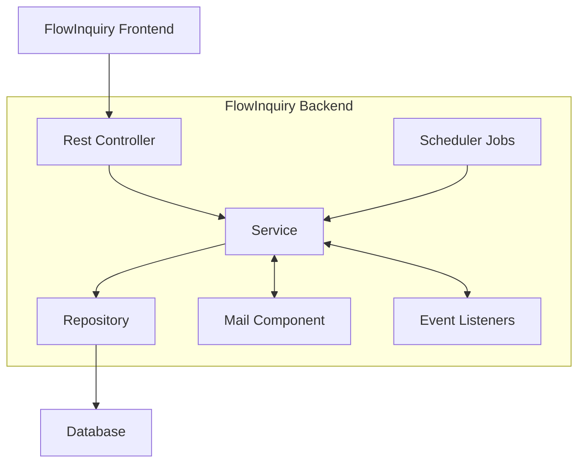

# High Level Architect

The FlowInquiry Backend is the core service layer of the FlowInquiry application, responsible for handling business logic, data management, event-driven actions, and integrations. It provides RESTful APIs to interact with the FlowInquiry Frontend and other systems, ensuring secure, scalable, and efficient operations. The backend adheres to a modular design where each component has a distinct responsibility to enhance maintainability and extensibility.

## 1. Rest Controller

Acts as the entry point for all API requests from the FlowInquiry Frontend.
Handles HTTP requests (e.g., GET, POST, PUT, DELETE) and routes them to the appropriate service layer.
Validates incoming data and transforms responses to fit client requirements.

## 2. Service

Contains the business logic for processing and managing application data.
Coordinates between different components like Repository, Mail Component, and Event Listeners.
Ensures data integrity and enforces application rules.

[MapStruct](https://mapstruct.org/) is extensively used at the service layer to seamlessly transform entities into data transfer objects (DTOs) and vice versa.

## 3. Repository

Facilitates direct interaction with the database, focusing solely on data access and manipulation.
Performs CRUD (Create, Read, Update, Delete) operations for backend entities with precision and efficiency.
Optimizes database queries to ensure high performance and reliability.
Does not include or manage any business logic, maintaining a clear separation of concerns in the FlowInquiry architecture.

## 4. Mail Component

Handles email communication with users and stakeholders, ensuring seamless interaction.
Sends notifications, alerts, and confirmations as triggered by the Service layer.
Formats emails and ensures reliable delivery through integration with external mail services.
While optional during the development stage, the Mail Service becomes a mandatory component in the production environment to support critical workflows.

We use [Thymeleaf](https://www.thymeleaf.org/) as a templating engine to generate HTML email formats for user communication

## 5. Event Listeners

Listens to and processes events published by the Service layer.
Facilitates event-driven architecture by decoupling components.
Executes asynchronous or scheduled tasks in response to events.

We use Spring Events to publish and handle events within the FlowInquiry process. To support a modular architecture and maintain separation of concerns, multiple event listeners can be assigned to a single event. While this design may occasionally result in duplicate database queries, we address this by leveraging caching or by having the Service layer prefetch and distribute common data to the listeners, thereby reducing redundant calls and improving overall efficiency.

## 6. Scheduler Jobs

Executes periodic or scheduled tasks within the backend.
Triggers predefined workflows, SLA checks, or cleanup operations.
Integrates with the Service layer to ensure scheduled tasks align with application logic.
We use [ShedLock](https://github.com/lukas-krecan/ShedLock) to ensure that identical jobs do not run in parallel, preventing potential conflicts and maintaining job consistency.
