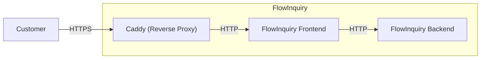

import { Callout, Tabs } from "nextra/components";

# Docker

## Build your own docker images

You can build your own Docker images and deploy them anywhere, or use the pre-built FlowInquiry images available on [Docker Hub](https://hub.docker.com/u/flowinquiry)

<Tabs items={['Front-end', 'Back-end']}>
    <Tabs.Tab>
        To build and publish Docker images for the FlowInquiry front-end, use the Dockerfile in the root folder along with the `scripts/docker_deployment.sh` script.
        Use the argument `--tag $version` if you want to customize the docker image version

        ```bash
        flowinquiry-frontend git:(main) scripts/docker_deployment.sh --tag 0.0.1
        Building Docker image...
        [+] Building 5.2s (22/22) FINISHED                                                                                                                                       docker:desktop-linux
        => [internal] load build definition from Dockerfile                                                                                                                                     0.0s
        => => transferring dockerfile: 2.35kB                                                                                                                                                   0.0s
        => [internal] load metadata for docker.io/library/node:20-alpine                                                                                                                        0.9s
        => [auth] library/node:pull token for registry-1.docker.io
        ...
        What's next:
        View a summary of image vulnerabilities and recommendations → docker scout quickview
        Tagging Docker image with '0.0.1' and 'latest'...
        Logging into Docker repository...
        Authenticating with existing credentials...
        ...
        latest: digest: sha256:94d85f12a3944c7dcbafc6c6851b0413c9e5c48dcb9c33bea54a88287130bd79 size: 2821
        Docker image has been pushed successfully with tags '0.0.1' and 'latest'.
        ```
    </Tabs.Tab>
    <Tabs.Tab>
        FlowInquiry backend uses Jib to build and deploy Docker images to the Docker repository. To change the Docker image
        version, edit the `projectVersion` attribute in the `gradle.properties` file.

        Open the terminal and navigate to the root folder. Use the command `./gradlew :server:jibDockerBuild -Djib.dockerClient.executable=/path/to/docker` to build the Docker image, or `./gradlew :server:jib  -Djib.dockerClient.executable=/path/to/docker` to build and deploy it.

        ```bash
        ➜  flowinquiry-server git:(main) ./gradlew :server:jibDockerBuild -Djib.dockerClient.executable=/usr/local/bin/docker

        > Task :server:jibDockerBuild

        Containerizing application to Docker daemon as flowinquiry/flowinquiry-server, flowinquiry/flowinquiry-server, flowinquiry/flowinquiry-server:0.0.1...
        ...

        Got output:

        Container entrypoint set to [bash, -c, /entrypoint.sh]

        Built image to Docker daemon as flowinquiry/flowinquiry-server, flowinquiry/flowinquiry-server, flowinquiry/flowinquiry-server:0.0.1
        Executing tasks:
        [==============================] 100.0% complete


        BUILD SUCCESSFUL in 4s

        ```
    </Tabs.Tab>

</Tabs>

## Multi-Platform Deployment

Our dedicated [repository](https://github.com/flowinquiry/flowinquiry-ops) provides all the resources needed for flexible deployment configurations. With both the frontend and backend packaged as
Docker images, FlowInquiry is ready to run on any platform compatible with containerized solutions, such as Kubernetes, Docker Swarm, AWS, Azure, and more

### Docker Compose

The Docker Compose example demonstrates how to quickly run FlowInquiry in a containerized environment, ideal for testing or local LAN use.
For more details, explore the flowinquiry-docker folder in the [flowinquiry-ops](https://github.com/flowinquiry/flowinquiry-ops) repository.



The FlowInquiry Docker Compose setup uses [Caddy](https://caddyserver.com/) as a reverse proxy to serve HTTPS even for both localhost and LAN environments.
Caddy is configured with a Caddyfile that supports the domains `localhost` and `local.flowinquiry.io`

```
local.flowinquiry.io, localhost {
    # Redirect HTTP to HTTPS
    @http {
        protocol http
    }
    redir @http https://{host}{uri}

    # Enable HTTPS with internal TLS
    tls internal

    # Match and reverse proxy for API routes (except /api/auth)
    @apiNotAuth {
        path /api/*
        not path /api/auth/*
    }
    reverse_proxy @apiNotAuth back-end:8080

    # Reverse proxy all other requests to the front-end
    reverse_proxy /* front-end:3000
}
```

You can change the domain name to any name you prefer.

<Callout type="info" emoji="ℹ️">
  If you use your custom domain in your local machine, remember to add it into
  the file `/etc/hosts`
</Callout>

Go to the folder `flowinquiry-docker`, and execute the scripts all.sh under the folder `scripts`

```bash
➜  flowinquiry-docker git:(main) ✗ scripts/all.sh
Running frontend_config.sh...
Environment variables have been written to .frontend.env
frontend_config.sh succeeded.
Running backend_create_secrets.sh...
Enter your database password:
Sensitive data has been written to ./.backend.env with restricted permissions.
backend_create_secrets.sh succeeded.
Running backend_mail_config.sh...
Enter your SMTP host: <smtp server>
Enter your SMTP port: <smtp port>
Enter your username: <user email>
Enter your password: <password>
Does SMTP require STARTTLS (y/n)? y
Please enter the email address that will be used as the sender for outgoing emails: noreply@flowinquiry.io
Please enter the base URL that will be used for the email template: https://local.flowinquiry.io
Configuration has been saved to .env.local
backend_mail_config.sh succeeded.
```

then run the docker compose `docker compose -f services.yml up`

```bash
➜  flowinquiry-docker git:(main) ✗ docker compose -f services.yml up
[+] Running 5/4
 ✔ Container flowinquiry-postgresql-1                                                                                                                         Created                     0.0s
 ✔ Container caddy                                                                                                                                         Runnin...                   0.0s
 ✔ Container flowinquiry-front-end-1                                                                                                                          Recreated                   0.1s
 ✔ Container flowinquiry-back-end-1                                                                                                                           Recreated                   0.1s
 ! back-end The requested image's platform (linux/amd64) does not match the detected host platform (linux/arm64/v8) and no specific platform was requested                             0.0s
Attaching to caddy, back-end-1, front-end-1, postgresql-1
back-end-1    | The application will start in 0s...
front-end-1   |   ▲ Next.js 14.2.16
front-end-1   |   - Local:        http://localhost:3000
front-end-1   |   - Network:      http://0.0.0.0:3000
front-end-1   |
front-end-1   |  ✓ Starting...
postgresql-1  |
...
back-end-1    | 03:46:11,368 |-INFO in ch.qos.logback.core.model.processor.AppenderRefModelHandler - Attaching appender named [CONSOLE] to Logger[ROOT]
back-end-1    | 03:46:11,368 |-INFO in ch.qos.logback.core.model.processor.DefaultProcessor@31064f47 - End of configuration.
back-end-1    | 03:46:11,368 |-INFO in org.springframework.boot.logging.logback.SpringBootJoranConfigurator@576dc710 - Registering current configuration as safe fallback point
back-end-1    |
back-end-1    | :: FlowInquiry 🤓  :: Running Spring Boot 3.3.5 :: Startup profile(s) prod ::
back-end-1    | :: https://www.flowinquiry.io ::

back-end-1    | 2024-11-10T03:46:32.394Z  INFO 1 --- [  restartedMain] io.flowinquiry.FlowInquiryApp.logApplicationStartup:129 : ----------------------------------------------------------
back-end-1    | 2024-11-10T03:46:32.395Z  INFO 1 --- [  restartedMain] io.flowinquiry.FlowInquiryApp.logApplicationStartup:130 :      Application 'FlowInquiry' is running! Access URLs:
back-end-1    | 2024-11-10T03:46:32.395Z  INFO 1 --- [  restartedMain] io.flowinquiry.FlowInquiryApp.logApplicationStartup:131 :      Local:          http://localhost:8080/
back-end-1    | 2024-11-10T03:46:32.395Z  INFO 1 --- [  restartedMain] io.flowinquiry.FlowInquiryApp.logApplicationStartup:132 :      External:       http://172.19.0.5:8080/
back-end-1    | 2024-11-10T03:46:32.396Z  INFO 1 --- [  restartedMain] io.flowinquiry.FlowInquiryApp.logApplicationStartup:133 :      Profile(s):     prod

```

Open the browser, and access to the address https//localhost or https://local.flowinquiry.io (or your custom domain). Use the default the either following credentials:

- Administrator:

  - Username: admin@flowinquiry.io
  - Password: admin

- User:
  - Username: user@flowinquiry.io
  - Password: user1234

#### Local HTTPS

Caddy uses its local CA to issue certificates, which means that HTTP clients outside the container won’t automatically trust the TLS certificate served by Caddy.
To resolve this, you may need to install Caddy's root CA certificate in your host machine’s trust store.

The Caddy root CA certificate can be found at flowinquiry-docker/caddy/certificate-authority/root.crt. This file is only generated when you run the FlowInquiry stack
with Caddy included. For detailed steps, refer to the Caddy documentation: [Local HTTPS with Docker](https://caddyserver.com/docs/running#local-https-with-docker)
